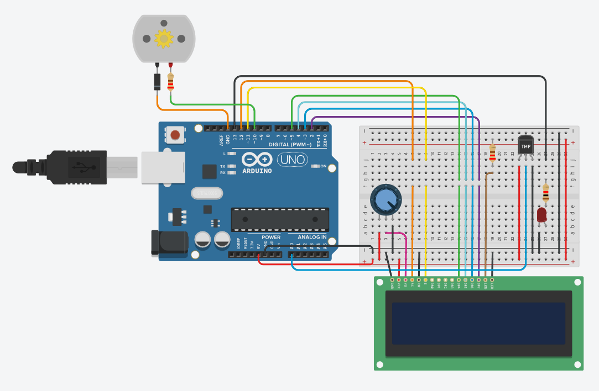

# 🔬 Laboratorio Nro. 4 – Programación de Rutinas en Arduino con Tinkercad


## 🏫 Universidad CESMAG  
**Espacio académico:** Sistemas Operativos  
**Docente:** *(Nombre del docente si deseas incluirlo)*  
**Estudiante:** Juan  
**Fecha:** Octubre 2025  

---

## 📌 Descripción general

Este laboratorio tiene como objetivo aplicar conceptos de programación de rutinas en sistemas embebidos utilizando la plataforma **Tinkercad** y el microcontrolador **Arduino Uno R3**. Se desarrolló un prototipo funcional que integra sensores, actuadores y una pantalla LCD para visualizar datos en tiempo real, simulando un sistema de monitoreo de temperatura con respuestas automatizadas.

---

## 🧠 Objetivos

- Diseñar un circuito electrónico en Tinkercad basado en el diagrama propuesto.
- Programar rutinas en Arduino para visualizar datos en una pantalla LCD.
- Integrar un sensor de temperatura TMP36 y realizar validaciones condicionales.
- Controlar un LED y un motor de corriente continua según rangos de temperatura.
- Versionar el código fuente en GitHub para seguimiento y documentación.

---

## 🧰 Componentes utilizados

| Nombre | Cantidad | Componente |
|--------|----------|------------|
| U1     | 1        | Arduino Uno R3 |
| U2     | 1        | LCD 16x2 |
| Rpot1  | 1        | Potenciómetro 250 kΩ |
| R1     | 1        | Resistencia 220 Ω |
| U3     | 1        | Sensor de temperatura TMP36 |
| D1     | 1        | LED rojo |
| R2     | 1        | Resistencia 1 kΩ |
| M1     | 1        | Motor de corriente continua |
| D2     | 1        | Diodo |

---

## 🛠️ Desarrollo del prototipo

### 🔧 Diagrama de conexión

📷 *Inserta aquí una imagen del circuito en Tinkercad*  
```markdown

